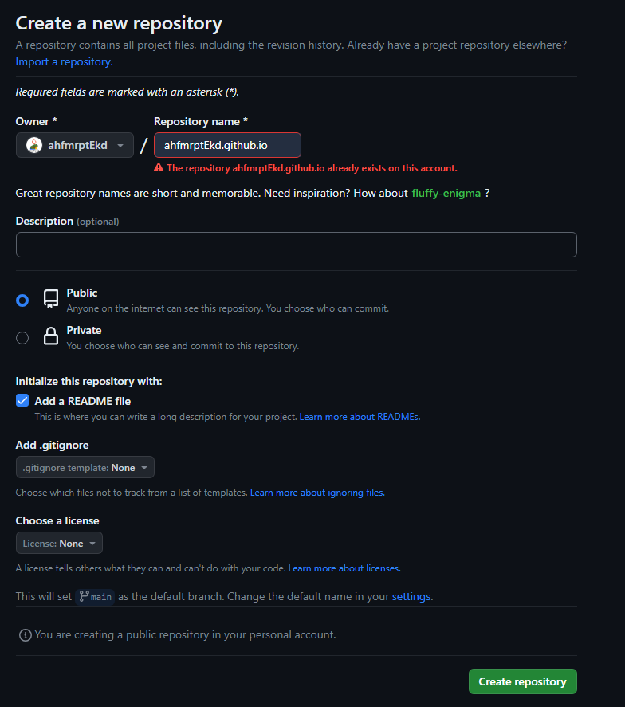

# Git Hub 블로그 만들기 

---

  

> 테디노트 TeddyNote (유튜버) 의 영상을 참조하여 글을 만들었습니다.
>
> [유튜브 링크](https://www.youtube.com/@teddynote) 

## Git Repository

1. Git Hub 에서 Repository를 만든다. 

     

     

   나는 이미 깃 블로그를 만들어서 레포지토리를 만들 수 없지만, 이름은 보통.  ""깃헛의 아이디 + github.io" 로 레포지토리를 설정한다.

   이게 사이트의 이름이 될 것이다.

   - 여기서 중요한 점
     - 레포지토리의 설정은 public으로 해야 딴 사람들이 볼 수 있다.
     - README file은 자동 생성하게 설정한다.

   그리고 마지막으로 **Create Repository**

     

     

2. 자신의 Desktop or  Laptop에 repository를 Git Clone 한다.

   - "Git Bash" or "명령 프롬프트" 에서 git clone 할 파일 경로를 찾아 들어간다.

     ```python
     cd <파일 경로>
     ```

     그 후

       

   - git clone +  레포지토리 주소 + .git 으로  clone 하는 코드를 쳐 준다.  그렇다면, 설정한 파일 경로에 레포지토리가 복사가 되고 레포지토리와 원격으로 연결된다.

     ```python
     git clone <git hub https address>.git
     ```

  

  

## Ruby 설치 하기

- 우리가 적용할 Theme 들은 Jekyll 기반으로 이 Jekyll은 Ruby라는 언어로 만들어져서 Ruby를 설치해야 합니다.

**Ruby 공식 홈페이지** [!https://rubyinstaller.org/downloads/](https://rubyinstaller.org/downloads/)

여기서 최소 3.0.0 버젼 이상의 WITH DEVKIT에서 다운 받아 실행합니다.

  

 - 여기서 WHY? 3.0.0?
   - Jekyll을 인스톨하고 쓰기 위해선 최소 3.0.0버젼이 필요했었다.. 내가. 
     (남들은 또 까는 고통이 없길 바래서 적어놨다.)

그리고 인스톨러를 설치 할 때 <u>이것</u>을 체크하면 직접 환경 변수 설정해야하는 수고로움을 건너 뛸 수 있다.


  

  

## Jekyll & Bundler 설치

- Cmd(명령 프롬프트) 에서 Jekyll 과 Bundler를 설치 한다.

  - > Bundler ==  루비 프로젝트에 필요한 gem 파일들의 올바른 버젼을 추적 & 설치하여서 일관된 환경을 제공하는 도구이다.

```python
gem install jekyll bundler

jekyll -v
```

- 위의 2 코드들을 입력하여서 jekyll이 잘 설치되어 있는지 확인할 수 있다.

    

  
  
  

## Jekyll 테마를 선택


  

  

- 원하는 Jekyll  테마들을 찾아 Local에 다운 받아 설정했었던 블로그 파일에 넣으면 된다.

나는 무난하게 보이는 [Minimal Mistakses Jekyll theme](https://github.com/mmistakes/minimal-mistakes)  을 이용했다.

그냥 Zip 파일로 받아 풀어서 덮어쓰기를 했다.


  

  

## Github Pages 서버와 연결하기

- git bash를 켜서 블로그 레포지토리 폴더 경로 cd 명령어로 이동한다. 
- 그리고 아래의 3개의 명령어를 실행하여 로컬에 덮었던 기본 파일들을 레포지토리에 업로드 한다.

```python
git add.
git commit -m "커밋 메세지"
git push origin main
```

  

**git add.** 는 폴더 내의 변경사항이 있는 파일들을 stage area에 올린다는 의미, " . " 은 변경이 있는 모든 파일을 올린다는 의미이다.

**git commit -m "커밋 메세지"** 는 stage area에 있는 파일들을 원격서버에 올릴 때 쓰는 메세지로 간단한 설명을 적고, 업로딩을 확정 짓는 과정.

**git push origin main** 는 git push remote branch 로 remote == 내 브렌치, branch == 원격서버의 메인 브렌치 이름.

​	보통 처음 아무 변경없이 레포지토리를 만드면, origin 과 main으로 설정 되어 있다.

---

```
개인 공부 기록용 블로그입니다.
틀린 부분은 댓글로 소통 & 지적 해주시면 감사하겠습니다!!!
```
